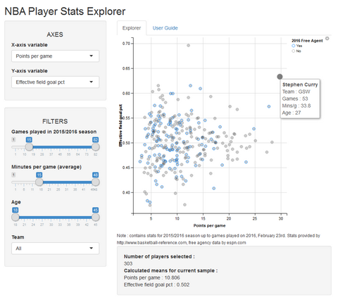

## About the Explorer

The *NBA Player Stats Explorer* aims to allow users to visually explore statistics related to the play during the 2015/2016 season of the [National Basketball Association](http://www.nba.com) (or *NBA*). 

NBA statistics are available in a number of places, but custom plotting of one statistic against another is nowhere to be found (to my admittedly limited knowledge). It will allow all NBA fans to get new insight on the abilities of their favorite players, and compare players against one another on various "profiles". For a *basic* example, you could ask "Who are the best inside-out players in the league?", and get a reasonable answer by plotting Rebounds against 3 point shots made.

--- &twocol

## Using the Explorer

*** =left
## 

You can choose which statistic to use on X and Y axes, and apply several filters on the data you want to show. On the right panel, the corresponding plot will show instantly. Mouse-over information is available to know which point represent which player. Means for both chosen X and Y variables are calculated on the fly on the current sample of players and shown right below the plot.


Filtering is done via the use of three sliders and one drop-down menu.

*** =right
## 
 

--- 

## The Data

All the statistics have been exported from [Basketball Reference](http://www.basketball-reference.com). Coverage starts on the first night of the season, and concludes with the games played on 2016, February 23rd. The list of Free Agents for the summer of 2016 has been exported from [ESPN](http://espn.go.com/nba). A consolidated CSV file has been created using both sources..

```{r set-options, echo = FALSE, cache = FALSE}
options(width = 170)
```

```{r echo = TRUE}
# Retrieve and inspect data
nbaData <- read.csv(file = "data/nbastats_20160224.csv")
head(nbaData, 5)
dim(nbaData)
```

---

## Possible Improvements

* Automate the CSV creation, as to be able to always have up-to-date statistics, and also to be able to filter by dates.
* Load other categories of statistics, including *Advanced Metrics*. 
* Allow filtering with more variables. 
* Allow choice of color-coded legend (currently only with free agency status).
* Allow for statistics from previous seasons to be loaded. 
* Add positions to the data set for more filtering possibilities.


## For further information

* [The application hosted on shinyapps.io](https://jcohensolal.shinyapps.io/NBAStatsExplorer/)

* [The GitHub page for this project](https://github.com/juliencohensolal/NBAStatsExplorer)
